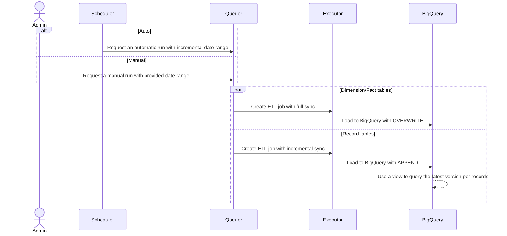

# Hustlesheets Close API ETL

- [Hustlesheets Close API ETL](#hustlesheets-close-api-etl)
  - [Architecture](#architecture)
  - [Components](#components)
    - [Source Code](#source-code)
      - [Image](#image)
      - [Queuer](#queuer)
      - [Executor](#executor)
      - [Config - Environment Variables](#config---environment-variables)
    - [Scheduler](#scheduler)
    - [Admin](#admin)
  - [Entrypoints](#entrypoints)
    - [`app`](#app)
    - [`gcloud`](#gcloud)
  - [Deployment](#deployment)
    - [Prequisites](#prequisites)
    - [Steps](#steps)

## Architecture

## Components

### Source Code

The entire solution is developed using Node.js with container using Docker.

It is also using the following products/services on GCP:

- Artifact Registry
- Cloud Run Job
- Cloud Scheduler
- BigQuery

#### Image

We use Docker images for managing the solution, and will deploy it as Cloud Run Job on GCP. As of now the Docker image is hosted on Github, and when it needs to be used in deployment, we can pull from Github and push into Artifact Registry.

#### Queuer

The first module of the solution, its functions are generating the job request for the Executor to work on.

#### Executor

The second module of the solution, its functions are taking in the job requests from Queuer and run the actual ETL job. It is configured to run 1 execution per table, in parallel.

#### Config - Environment Variables

The above modules are packed within one Docker image, with multiple configurable environment variables. Please refer to [.env.example](.env.example).

| Key | Description | Example |
| --- | --- | --- |
| GOOGLE_APPLICATION_CREDENTIALS | Configure the service account on GCP used through out the deployments, creation, and execution of the job. **Not Required** when deploying on Cloud Run | |
| CLOSE_API_KEY | Close API key to be used | api_XX |
| BIGQUERY_DATASET | BigQuery Dataset to load data to | CloseV2 |

### Scheduler

We will use Cloud Scheduler as the cron scheduler for the solution. It is configured by default to run daily at 00:00 UTC.

### Admin

The Admin here is the maintainer for the entire solution. They will take care of backfilling and making sure everything works as intended.

## Entrypoints

The solution is packaged as docker images. There are two Docker app (declared in [docker-compose.yml](docker-compose.yml)). The [docker-compose.yml](docker-compose.yml) has been configured with the service account JSON file as `service-account.json` and the `.env` in the root directory.

### `app`

The core ETL module. We can use it for the Queuer or the Executor.

| Command | Description |
| --- | --- |
| `docker-compose run --rm app queue -s YYYY-MM-DD -e YYYY-MM-DD` | Create jobs on the executor |
| `docker-compose run --rm app execute -p Lead -s YYYY-MM-DD -e YYYY-MM-DD` | Execute job |

### `gcloud`

Devops module. We can use it to initialize the solution on any GCP project. Please refer to the [Makefile](Makefile) for commands and what does it do. The commands are listed in order of execution (i.e. please run it one by one).

| Command | Description |
| --- | --- |
| `docker-compose run --rm gcloud make create-image` | Create Artifact Registry Repository, Push Image into AR |
| `docker-compose run --rm gcloud make create-job` | Create Cloud Run Jobs |
| `docker-compose run --rm gcloud make create-schedule` | Create Cloud Schedule schedule |

There are also some configuration needed. They are declared in [Makefile](Makefile). Some of values will be varied between clients, while some does not necessary be.

| Key | Description | Varies between client required? |
| --- | --- | --- |
| PROJECT_ID | GCP Project ID | **Yes**
| PROJECT_NUMBER | GCP Project Number | **Yes**
| AR_REPOSITORY | AR Repository Name | No
| GH_IMAGE | Source Image on Github | No
| AR_IMAGE | Forwarded Image on AR | **Yes**
| QUEUER_JOB_NAME | Cloud Run Job Name for Queuer | No
| EXECUTOR_JOB_NAME | Cloud Run Job Name for Executor | No

## Deployment

### Prequisites

- Docker

### Steps

1. Create a service account on the targeted GCP project. Save its key as `service-account.json` within the root directory
2. Create the [.env](.env) file container configuring environment variables. Please refer to [.env.example](.env.example).
3. Modify the [Makefile](Makefile) as needed for deployment.
4. Run `docker-compose run --rm gcloud make create-image` without error.
5. Run `docker-compose run --rm gcloud make create-job` without error.
6. Create a BigQuery Dataset for Close data. Make sure that the name matches what's on [.env](.env).
7. Run `docker-compose run --rm app queue -s YYYY-MM-DD -e YYYY-MM-DD` as a test for queueing job requests.
8. Run `docker-compose run --rm gcloud make create-schedule` without error.
9. Verify everything on GCP console.
