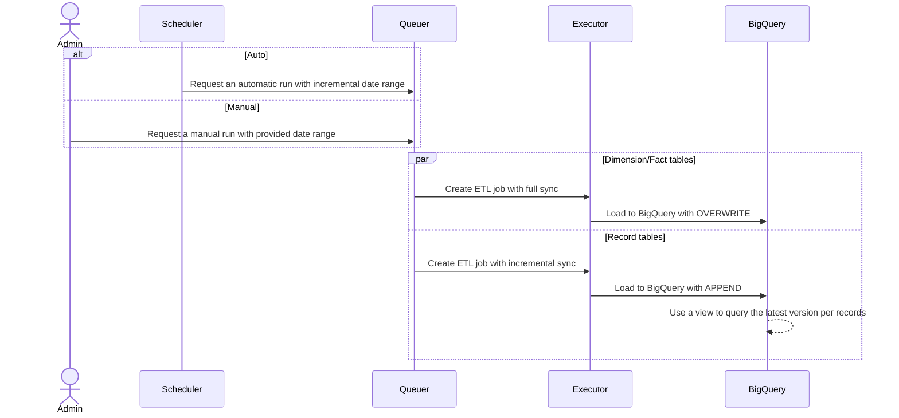

# Hustlesheets Close API ETL

## Architecture



## Components

### Source Code

#### Image

We use Docker images for managing the solution, and will deploy it as **Cloud Run Job** on GCP. As of now the Docker image is hosted on **Github**, and when it needs to be used in deployment, we can pull from **Github** and push into **Artifact Registry**.

Since it's hosted on **Github**, we can pull it using `docker pull`

#### Queuer

The first module of the solution, its functions are generating the job request for the Executor to work on.

#### Executor

The second module of the solution, its functions are taking in the job request from Queuer and run the actual ETL job. It is configured to run 1 execution per table, in parallel.

#### Config - Environment Variables

The above modules are packed within one Docker image, with multiple environment variables to config to solution.

| Key | Description | Example |
|---|---|---|
| GOOGLE_APPLICATION_CREDENTIALS | Configure the service account on GCP used through out the deployments, creation, and execution of the job. **Not Required** when deploying on Cloud Run| |
| CLOSE_API_KEY | Close API key to be used | api_XX |
| BIGQUERY_DATASET | BigQuery Dataset to load data to | CloseV2 |

### Scheduler

We will se **Cloud Scheduler** as the cron scheduler for the solution. It is configured by default to run daily at 00:00 UTC

### Admin

The Admin here is the maintainer for the entire solution. They will take care of backfilling and making sure everything works as intended

## Use Cases

### Run all pipelines on automatic

Refer to the Architecture. It is configured on automatic mode to get the data from at least D-4 days for incremental sync

### Run specific pipeline on manual with user-provided input

Refer to the Architecture. Run the Docker image locally with mounting Service Account JSON file with this command:

```shell
docker-compose run app execute -p Lead -s YYYY-MM-DD -e YYYY-MM-DD
```

### Deploy to other client

1. Create a service account on a GCP project. Assign it with permission required for:
    - Artifact Registry: To push image to it
    - Cloud Run: To create job and execute job
    - BigQuery: To load data
    - Cloud Scheduler: To schedule the Queuer
2. Create an **Artifact Registry** Docker repository
3. Pull the docker image from **Github** and push it into the current project Docker repository from (2). The output should be the image name
4. Create the Queuer Job on Cloud Run using (3)
5. Create the Executor Job on Cloud Run using (3)
6. Create the Cloud Scheduler Job invoking the Queuer (4)
